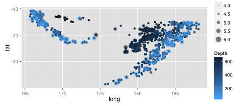

## DataSet

The dataset used in this post is the "quakes" data set from R. 

The Dataset contains a thousand observations of seismic activity in and around the Fiji Islands. 

The Variables in the Data set included the Latitude, Longitude, Depth and Magnitude of each event along with the number of stations that registered the event.

--- 

## Examining the Data

In order to visualize the data we used the ggplot2 library and indicated depth by reversing  the default color scale. Here you can see that the darker blue event represent lower depths and the size of the circles indicate the magnitude of the event. You can already to see areas that have higher activity and areas that seem to contain more extreme events.


```r
library(ggplot2); data(quakes)
ggplot(quakes, aes(long, lat), na.rm = TRUE) + 
  geom_point(color = "black") +
  geom_point(aes(size = mag, color = depth), alpha = 1/2) + 
  scale_color_gradient("Depth", high = "#132B43", low = "#56B1F7")
```

 

---
## Distribution of Magnitudes

Another interesting feature of the dataset is that the magnitudes are exponentially scaled so the distribution of activity is skewed toward lower magnitude events. This is reflected in the clustering as we see the Mean Magnitude for each cluster converge

Below is a chart showing the distribution of events by magnitude:


```r
hist(quakes$mag)
```

 


---
## Why this is Useful(The Pitch!)

An app like this is useful because it lets the end user gain some intutition around a very basic form of data compression. As the user moves the slider back and forth along the axis they'll see not only how the image changes (or doesnt), but also how the inter-cluster variance changes. 

Although this is a relatively small data set we it's highly clustered in some areas and so is a good candidate for k-means to be used to reduce the number of samples without meaningfully changing the distribution of the underlying data.

Also, in a very Tufte way the graph shows a useful way to visualize higher dimensions of data (dims > 3), using aesthetics like color and size.


---
## Future Development

Additionaly Development might by to add other visuals into the app or some sort of prediction aspect. Also, i'm very interested in exploring the data in 3 dimenisions. I think that would provide an even more engaging way to interact with the k-means clustering algorithm. Either that or some form of animation...


