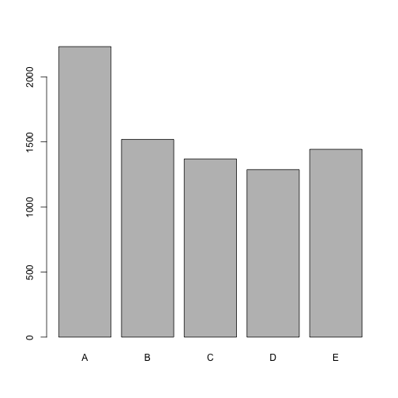

The development of the model was pretty straight forward. The primary challenge with this data set was identifying the meaningful subset of features from the raw data. In order to manage this there are several steps designed to filter out columns that arent particularly useful:

##1. Load Libraries and Data

First we load the two libraries we'll be using and set the seed. Finally we load the training data csv.


```r
library(caret); library(ggplot2)
set.seed(42)
har <- read.csv("pml-training.csv", header = T)
```


Next we split the data into a test and train set using a 70/30 Split


```r
trainIdx <- createDataPartition(har$classe, p = 0.4, list = F)

har.train <- har[trainIdx, ]
har.test <- har[-trainIdx, ]
remove(har)

har.train.X <- har.train[, -160]
har.train.Y <- har.train[, 160]
har.test.X <- har.test[, -160]
har.test.Y <- har.test[, 160]

remove(har.train, har.test)
```

##2. Data Cleaning

In order to handle the data cleaning I defined a few convenience functions

The first simply handles the task of converting factor variables to numeric. Because there are strings in some of the numeric columns this is necessary to recast the data to the appropriate format.


```r
as.numeric.factor <- function(x) {as.numeric(levels(x))[x]}
```

The next function is designed to apply the as.numeric.factor function over a give data frame converting all factor columns into numeric.


```r
convertFactorToNumeric <- function(df){
  cols <- dim(df)[2]
  for(i in 1:cols){
    if(is.factor(df[, i])){
      df[, i] <- as.numeric.factor(df[, i])
    }
  }
  return(df)
}
```

The following function is designed to identify any cols in a dataframe where the number of NA's or incomplete values is greater than some threshold, in this case i used 50%.


```r
colsWithLargeNumberNA <- function(df, NA.Threshold = 0.5){
  cols <- dim(df)[2]
  rows <- dim(df)[1]
  colsPastThreshold <- numeric()
  for(i in 1:cols){
    proportionMissing <- sum(is.na(df[, i]))/rows
    if(proportionMissing >= NA.Threshold){
      colsPastThreshold <- c(colsPastThreshold, i)
    }
  }
  return(colsPastThreshold)
}
```

The final function that we define is the pre-processing sequence for the training data.

Here we're going through a couple of steps:
1.  Remove a set of predetermined columns that deal more with how the data was captured and aren't useful/generalizable predictors such as the timestamp, user name, row number, etc.

2.  Since the remaining columns should all be numeric variables we run the converFactorToNumeric function on the data frame to convert columns where necessary.

3.  Most of the columns that were loaded originally as factors actually contain a lot of incomplete cases and should be removed from the analysis. Here we use colsWithLargeNumberNA to scan the dataframe and identify any such variables so that they can be removed from the analysis.

4. Finally, we run a near zero variance test to identify and remove any columns that have insufficient variability(in this particular implementation this is redundant, but is still a useful step)


```r
preProcessTrain <- function(X){
  #remove non-numeric and other miscellaneous data points
  colsToRemove <- c("X", "user_name", "raw_timestamp_part_1", "raw_timestamp_part_2", 
                    "cvtd_timestamp", "new_window", "num_window")
  colRemoveBool <- names(X) %in% colsToRemove
  X <- X[, !colRemoveBool]
  
  X <- convertFactorToNumeric(X)

  col.high.perc.NA <- colsWithLargeNumberNA(X)
  
  if(length(col.high.perc.NA) > 0){
    X <- X[, -col.high.perc.NA]
  }
  
  X.nzv <- nearZeroVar(X)
  
  if(length(X.nzv) > 0){
    X <- X[, -X.nzv]
  }
  return(X)
}
```


Now In Order to Process the Training Data we simply run the following Command


```r
har.train.X.preproc <- preProcessTrain(har.train.X)
dim(har.train.X.preproc)
```

```
## [1] 7850   52
```

We'll also use the column names from the preprocessed data to filter the test set in the future

```r
cols <- names(har.train.X.preproc)
```

##3. Modelling

Before we begin modelling let's define some benchmarks.

For model evaluation we'll measure accuracy based on the simple metric: 
  (# of correct predictions)/(total number of cases)


###Baselining
To determine our baseline accuracay there are 5 variables if we just randomly guess we would expect to have an overall accuracy rate of around 20%


```r
choices <- c("A", "B", "C", "D", "E")
res <- rep(NA, length(har.test.Y))
for(i in 1:length(har.test.Y)){res[i] <- sample(choices, 1)}
sum(har.test.Y == res)/length(har.test.Y)
```

```
## [1] 0.2009004
```

Using another naive test we could just guess the most frequent case. In the training data set this is "A"


```r
barplot(table(har.train.Y))
```

 

So a model guessing only "A" provides results slightly better than random guessing


```r
sum(har.test.Y == "A")/length(har.test.Y)
```

```
## [1] 0.2844037
```


###Decision Tree
The first predictive model I like to start with a basic decision tree, since it's robust to feature scaling. Here we'll use the model mainly as a benchmark to gauge the quality of other models.

Because of the size of the data we'll be using I also want to adjust the default training Controls.


```r
trControl = trainControl("cv", number = 4)
modFit.dtree <- train(y = har.train.Y, x = har.train.X.preproc, 
                      method = "rpart", 
                      trControl = trControl)
```

The out of Sample Error for this model is a significant improvement on the baseline naive model, but can still be improved upon a great deal. Also, what we see below is that the model has a significant bias. For example it estimates heavily the class "A"(the most prevalent class) and doesnt provide any estimate for the class "D."


```r
test.pred <-  predict(modFit.dtree, har.test.X[, cols])
sum(test.pred == har.test.Y)/length(har.test.Y)
```

```
## [1] 0.493544
```

```r
table(test.pred, har.test.Y)
```

```
##          har.test.Y
## test.pred    A    B    C    D    E
##         A 3044  967  958  862  324
##         B   51  766   70  345  288
##         C  246  545 1025  722  577
##         D    0    0    0    0    0
##         E    7    0    0    0  975
```

###Knn

Another simple model that performs well for classification tasks is K Nearest Neighbors. However, because of the number of dimensions in the data set it's usually preferrable to reduce the dimenisionlity before applying the knn algorithm. To handle that we'll be using PCA in our preProcessing Step.


```r
modFit.knn <- train(y = har.train.Y, x = har.train.X.preproc, 
                      method = "knn", 
                      preProcess = c("pca"),
                      trControl = trControl)
modFit.knn
```

```
## k-Nearest Neighbors 
## 
## 7850 samples
##   52 predictor
##    5 classes: 'A', 'B', 'C', 'D', 'E' 
## 
## Pre-processing: principal component signal extraction, scaled, centered 
## Resampling: Cross-Validated (4 fold) 
## 
## Summary of sample sizes: 5888, 5887, 5887, 5888 
## 
## Resampling results across tuning parameters:
## 
##   k  Accuracy   Kappa      Accuracy SD  Kappa SD   
##   5  0.8915931  0.8627739  0.006284607  0.007918730
##   7  0.8750319  0.8418285  0.004563745  0.005785431
##   9  0.8542681  0.8155949  0.005909525  0.007468248
## 
## Accuracy was used to select the optimal model using  the largest value.
## The final value used for the model was k = 5.
```

As we can see the modFit.knn model performs considerably better than the plain decision tree at the optimal tuning parameter of K = 5 

When we compare it to the test set we also get a significant improvement over the simple decision tree with an out of sample accuracy of 92.4%

```r
test.pred <-  predict(modFit.knn, har.test.X[, cols])
sum(test.pred == har.test.Y)/length(har.test.Y)
```

```
## [1] 0.9231227
```

```r
table(test.pred, har.test.Y)
```

```
##          har.test.Y
## test.pred    A    B    C    D    E
##         A 3218  138   16   16   18
##         B   31 1987   71   11   63
##         C   62  114 1929  144   43
##         D   36   27   25 1743   50
##         E    1   12   12   15 1990
```

The out of Sample Error for this model is a significant improvement on the prior model, but can still be improved upon further by using a more robust technique like random forests.

###Random Forest

The next model we'll be trying is the Random Forest Model. The model has two main tuning parameters the first is the # of trees and the second is the number of variables used at the creation of each branch (mtry). The default value for ntree is 500, but that's a bit overkill in our case we can determine a better cut-off for ntree by running the random Forest with its default parameters and seeing where we see the error rate flatten out (sometime called the elbow of the diagnostic plot).


```r
library(randomForest)
tmp <- randomForest(x = har.train.X.preproc, y = har.train.Y)
plot(tmp$err.rate[, "OOB"])
```

 

Based on this test we can reasonably assume a value of ntree at 150, should be adequate for our dataset. Now when we tune the algorithm on the training data set it'll help us determine the appropriate value of mtry.


```r
modFit.rf <- train(y = har.train.Y, x = har.train.X.preproc, 
                   method = "rf", 
                   ntree = 150,
                   trControl = trControl)
modFit.rf
```

```
## Random Forest 
## 
## 7850 samples
##   52 predictor
##    5 classes: 'A', 'B', 'C', 'D', 'E' 
## 
## No pre-processing
## Resampling: Cross-Validated (4 fold) 
## 
## Summary of sample sizes: 5888, 5886, 5889, 5887 
## 
## Resampling results across tuning parameters:
## 
##   mtry  Accuracy   Kappa      Accuracy SD  Kappa SD   
##    2    0.9793623  0.9738834  0.005715502  0.007239974
##   27    0.9806373  0.9755033  0.002077308  0.002632461
##   52    0.9749039  0.9682508  0.003640807  0.004605697
## 
## Accuracy was used to select the optimal model using  the largest value.
## The final value used for the model was mtry = 27.
```

The tuning indicates that a value of mtry = 27 produces the best results and based on that the Final Model has an accuracy of about 99% on the Test Set. You don't get much better than that!


```r
test.pred <-  predict(modFit.rf, har.test.X[, cols])
sum(test.pred == har.test.Y)/length(har.test.Y)
```

```
## [1] 0.9866633
```

```r
table(test.pred, har.test.Y)
```

```
##          har.test.Y
## test.pred    A    B    C    D    E
##         A 3345   36    0    0    0
##         B    2 2227   23    2    1
##         C    1   15 2019   50    7
##         D    0    0   11 1876    8
##         E    0    0    0    1 2148
```

Based on the results it's clear that a Random Forest with little other tuning performs exceptionally well on the problem.
